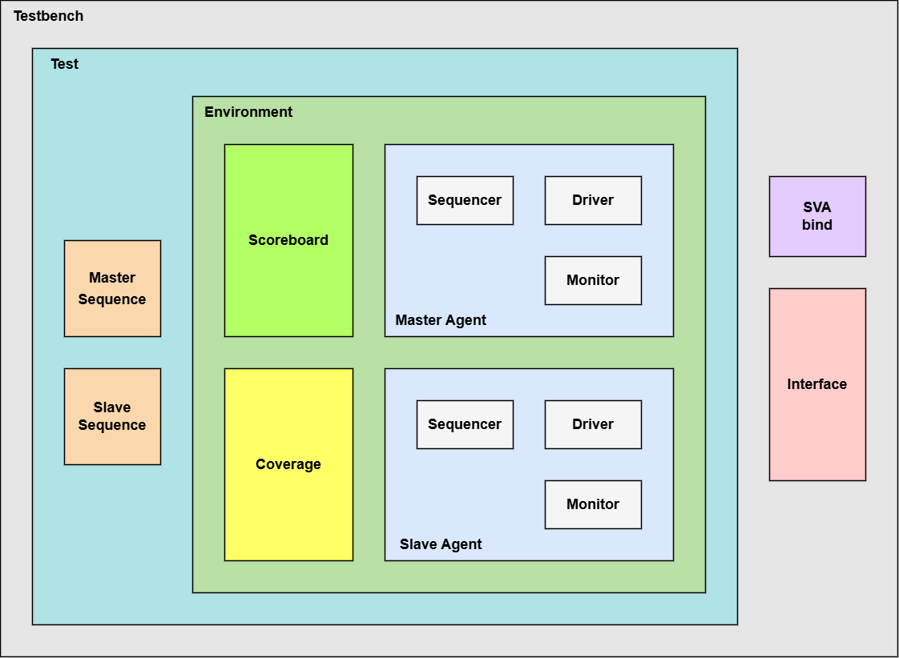

<!--
OWNERSHIP NOTE
Original unmarked project/code: Huy Le / legiahuy15/AXI4-VIP
Hoang Ho documentation additions are marked with HTML comments.
SystemVerilog contribution blocks are marked //Hoang Ho.
-->

# AXI4 UVM Verification IP

A parameterized, learning-oriented AMBA AXI4 Full Verification IP written in SystemVerilog/UVM. The environment is self-contained: an active master agent communicates directly with an active slave agent through a shared `axi4_if`, so no external DUT is required.

The project targets the core functional rules of Arm AMBA AXI4 memory-mapped transactions. It is not presented as a commercial compliance product.

## Architecture

The master sequence/driver generates traffic on AW, W, and AR and accepts B/R responses. The reactive slave contains a byte-addressable memory model and configurable delays. Master and slave monitors independently reconstruct completed transactions. The scoreboard compares both observations and maintains a reference memory. `axi4_sva` checks protocol rules directly on the interface.



| Component | Responsibility |
|---|---|
| `axi4_if` | Five AXI4 channels, clocking blocks, and modports |
| `axi4_master_agent` | sequencer, master driver, and master monitor |
| `axi4_slave_agent` | reactive subordinate driver and slave monitor |
| `axi4_scoreboard` | transaction matching and byte-level data integrity |
| `axi4_coverage` | burst, size, response, address, WSTRB, and timing coverage |
| `axi4_sva` | handshake, stability, dependency, burst, lane, ID, and response checks |

## Functional profile

- Configurable address, data, and ID widths; default 32/32/4.
- FIXED, INCR, and WRAP bursts.
- INCR burst length up to 256 beats; FIXED/WRAP restrictions enforced.
- Narrow and unaligned transfers with Arm-style byte-lane calculation.
- Exact 4KB burst-container checking.
- Partial/sparse/zero-subset WSTRB support, restricted to legal transfer lanes.
- AW/W independence: parallel, AW-before-W, and W-before-AW.
- Multiple outstanding reads/writes and different-ID out-of-order completion.
- Same-ID response order preservation.
- Simplified exclusive access with EXOKAY/OKAY success/failure behavior.
- OKAY, EXOKAY, SLVERR, and DECERR response paths.
- Request-side and response-side backpressure.
- Reset-mid-transaction recovery.

<!-- Hoang Ho - Corrected AXI4 read-data interleaving statement -->
The default learning subordinate sends one complete read burst at a time for deterministic waveforms. AXI4 can interleave read-data beats from different IDs when the subordinate supports it. The updated master driver and both monitors dispatch every accepted R beat by `RID`, so legal cross-ID interleaving is accepted even though it is not generated by default. Transactions sharing one ID remain ordered.

## Deliberate limits

Optional attributes `AxCACHE`, `AxPROT`, `AxQOS`, and `AxREGION` are transported, held stable, compared, and covered, but no real cache, permission, QoS arbitration, or region-decode semantics are modeled. USER signals, ACE/coherency, AXI5 features, mixed-endian conversion, and full interconnect routing are out of scope.

The scoreboard uses a simple completed-transaction memory policy. Data-integrity tests serialize conflicting read/write access to the same location instead of claiming a universal system memory-ordering model.

## Repository layout

```text
src/
  axi4_if.sv
  axi4_pkg.sv
  axi4_test_pkg.sv
  tb_top.sv
  cfg/     protocol types, transaction, config
  mst/     master agent, driver, monitor, sequencer
  slv/     slave agent, driver, monitor, sequencer
  seq/     sequence library
  env/     environment, scoreboard, coverage
  sva/     protocol assertions and SVA unit TB
  test/    UVM tests
sim/       QuestaSim Makefile and reports
doc/       VPlan, test plan, contribution documentation
```

## Test library

The positive regression list is defined by `TEST_LIST` in `sim/Makefile`.

| Group | Tests |
|---|---|
| Basic/random | `axi4_sanity_test`, `axi4_random_test` |
| Burst/lanes | `axi4_all_burst_type_test`, `axi4_burst_sweep_test`, `axi4_narrow_burst_test`, `axi4_unaligned_test`, `axi4_strobe_test`, `axi4_4kb_boundary_test` |
| ID/order | `axi4_outstanding_test`, `axi4_out_of_order_test`, `axi4_back_to_back_test`, `axi4_ooo_demo_test` |
| Timing | `axi4_backpressure_test`, `axi4_response_backpressure_test`, `axi4_wr_order_demo_test`, `axi4_wlast_before_aw_test` |
| Responses/exclusive | `axi4_error_response_test`, `axi4_exclusive_test`, `axi4_exclusive_fail_test`, `axi4_illegal_exclusive_test`, `axi4_exclusive_demo_test` |
| Integrity/reset | `axi4_data_integrity_test`, `axi4_addr_integrity_test`, `axi4_reset_mid_burst_test` |
| Attributes | `axi4_cache_prot_test` |
| Hoang Ho directed gate | `axi4_helper_unit_test`, `axi4_spec_corner_test` |

<!-- Hoang Ho - New focused functional gate -->
`axi4_helper_unit_test` checks exact lane/address equations. `axi4_spec_corner_test` verifies unaligned/narrow transfers, page-edge WRAP, same-ID order, and a continuously asserted WREADY subordinate.

## Running with QuestaSim

```bash
cd sim

make help
make run TESTNAME=axi4_sanity_test SEED=1
make spec_smoke
make -j8 regress NUM_RUNS=5
make cov_report
```

`make spec_smoke` runs:

```text
axi4_helper_unit_test                 seed 1
axi4_spec_corner_test                 seed 1
axi4_4kb_boundary_test                seed 1
axi4_response_backpressure_test       seed 22883092
axi4_response_backpressure_test       seed 68865829
```

The Makefile treats a non-zero simulator status, any non-zero UVM_ERROR/UVM_FATAL count, or `=== TEST FAILED ===` as a failing command. Coverage merging excludes an old `merged.ucdb` and regenerates the HTML directory.

## Contribution markers

<!-- Hoang Ho -->
Huy Le's existing author headers and unmarked source are retained. New or materially modified SystemVerilog blocks are marked `//Hoang Ho`; entirely new source files begin with `//Hoang Ho - New file`. See:

- `doc/CODE_OWNERSHIP_MAP.md`
- `doc/HUY_LE_VS_HOANG_HO_DIFF.md`
- `doc/CONTRIBUTION_GUIDE.md`
- `doc/AXI4_FULL_VPLAN.md`
- `doc/AXI4_FULL_TESTPLAN.md`

## Validation status

The response-backpressure repair was previously run successfully on QuestaSim for seeds `22883092` and `68865829`. The larger Arm-functional patch in this package has been statically reviewed, but the artifact environment does not contain QuestaSim. Run `make clean`, `make spec_smoke`, the complete regression, and coverage review on the target server before publishing or opening a pull request.

## License and attribution

The original repository uses the MIT License. Preserve the original license, Huy Le attribution, and contributor markers when publishing this extension.
