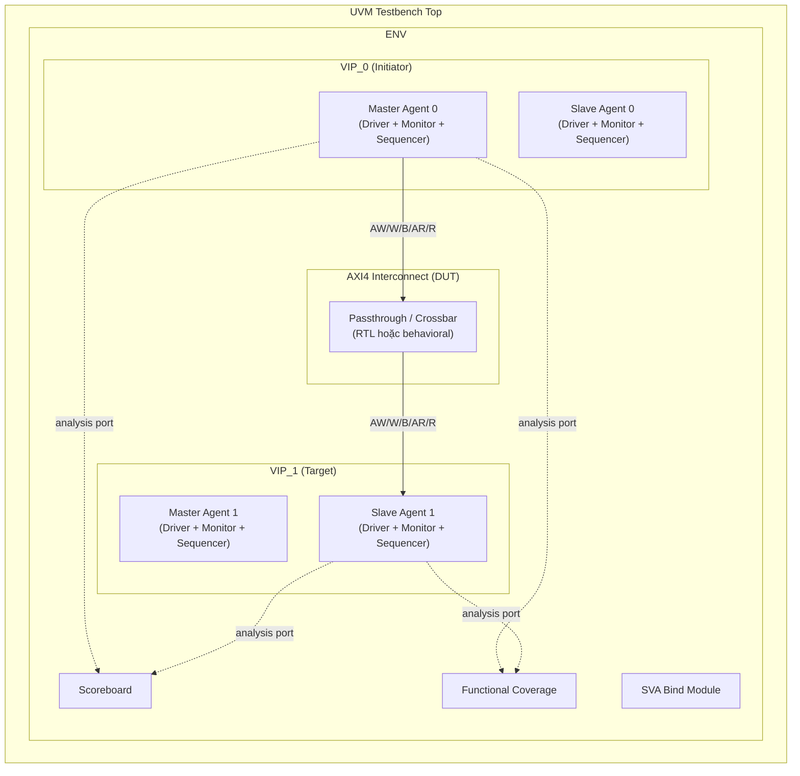
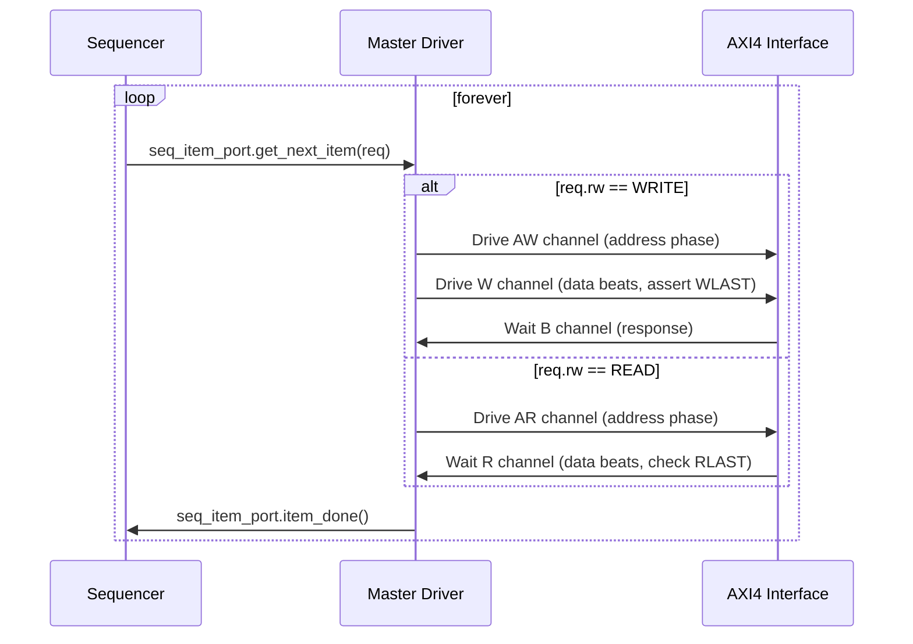
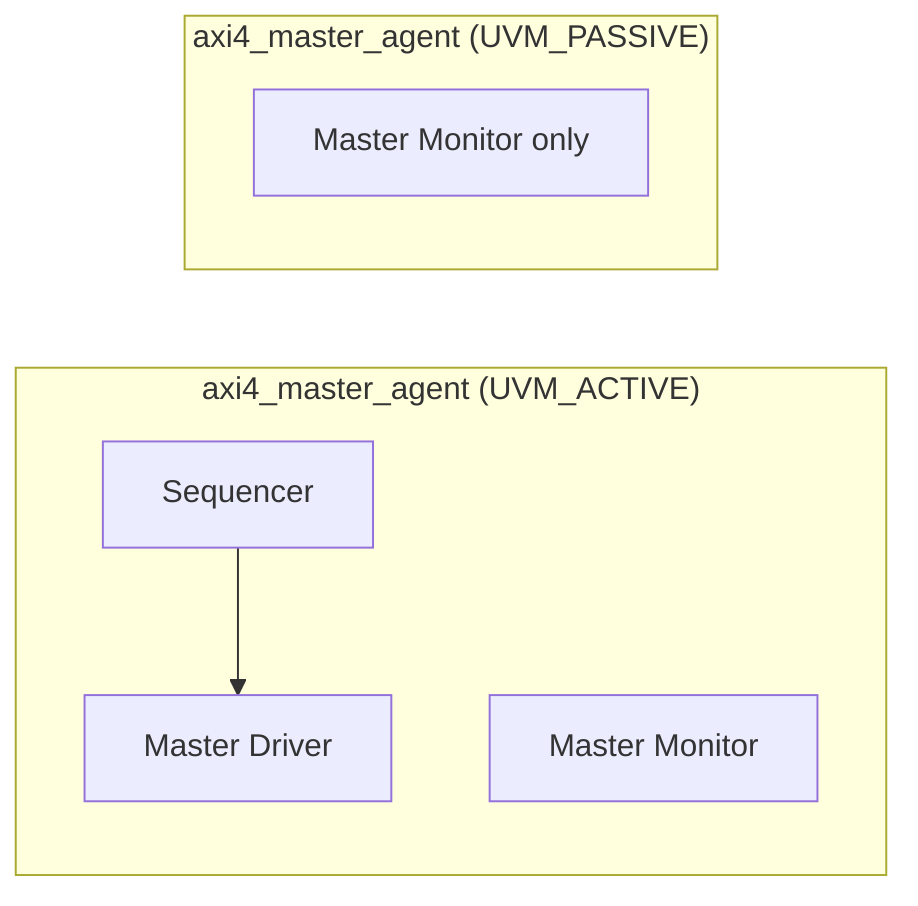
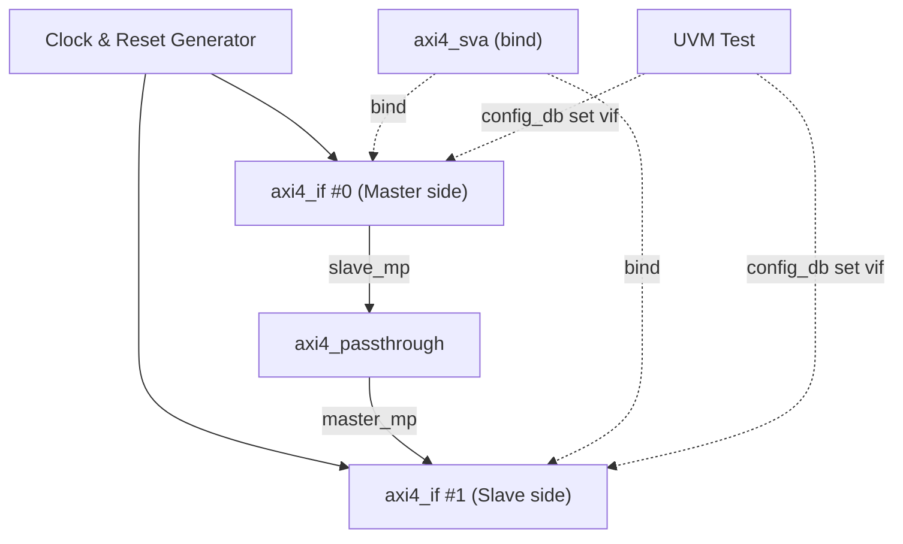
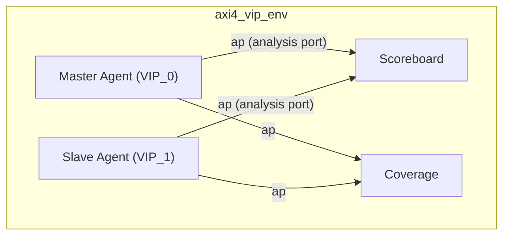
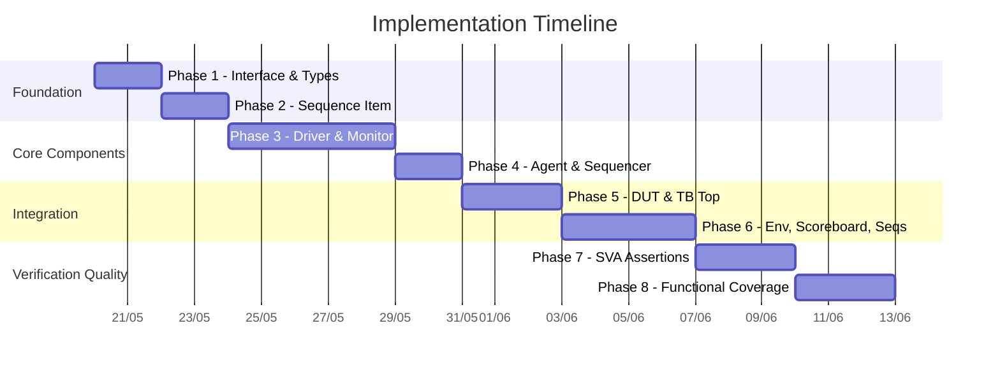

# 🗺️ Lộ Trình Xây Dựng UVM VIP-to-VIP AXI4

## 📐 Kiến Trúc Tổng Thể



### Giải thích luồng dữ liệu

| Hướng | Vai trò | Mô tả |
|-------|---------|-------|
| **VIP_0 Master → DUT → VIP_1 Slave** | Write/Read request | Master 0 phát transaction, Slave 1 nhận và phản hồi |
| **VIP_1 Slave → DUT → VIP_0 Master** | Response | Slave 1 trả response ngược về Master 0 |
| **Monitor → Scoreboard** | Analysis | Monitor ở cả 2 đầu gửi observed transactions tới scoreboard để so sánh |
| **Monitor → Coverage** | Sampling | Monitor gửi transactions tới coverage collector |

> [!NOTE]
> Trong kiến trúc VIP-to-VIP, DUT (Device Under Test) là một **AXI4 interconnect đơn giản** (passthrough hoặc crossbar). Mục đích chính là verify chính VIP — đảm bảo master/slave driver, monitor, protocol assertions hoạt động đúng. Ban đầu có thể dùng passthrough (nối thẳng), sau này nâng cấp lên crossbar nếu muốn.

> [!IMPORTANT]
> Mỗi VIP chứa **cả master agent lẫn slave agent**, nhưng trong một topology cụ thể, chỉ **một agent active** tại một thời điểm. VIP_0 active master agent, VIP_1 active slave agent. Cấu hình active/passive qua UVM config_db.

---

## 📁 Cấu Trúc Thư Mục Đề Xuất

```
axi4_vip/
├── src/
│   ├── axi4_pkg/                    # AXI4 VIP package (reusable)
│   │   ├── axi4_if.sv               # AXI4 interface
│   │   ├── axi4_types.sv            # Typedefs, enums, parameters
│   │   ├── axi4_seq_item.sv         # Sequence item (transaction)
│   │   ├── axi4_master_driver.sv    # Master driver
│   │   ├── axi4_slave_driver.sv     # Slave driver
│   │   ├── axi4_master_monitor.sv   # Master-side monitor
│   │   ├── axi4_slave_monitor.sv    # Slave-side monitor
│   │   ├── axi4_master_sequencer.sv # Master sequencer
│   │   ├── axi4_slave_sequencer.sv  # Slave sequencer
│   │   ├── axi4_master_agent.sv     # Master agent
│   │   ├── axi4_slave_agent.sv      # Slave agent
│   │   ├── axi4_agent_config.sv     # Agent configuration object
│   │   ├── axi4_pkg.sv              # Package file (import all)
│   │   └── axi4_sva.sv              # SVA assertions module
│   │
│   ├── axi4_interconnect/           # Simple DUT
│   │   └── axi4_passthrough.sv      # Passthrough interconnect
│   │
│   ├── env/                         # Testbench environment
│   │   ├── axi4_vip_env_config.sv   # Environment config
│   │   ├── axi4_vip_env.sv          # Environment (instantiates agents, scoreboard, coverage)
│   │   ├── axi4_scoreboard.sv       # Scoreboard
│   │   └── axi4_coverage.sv         # Functional coverage collector
│   │
│   ├── seq_lib/                     # Sequence library
│   │   ├── axi4_base_seq.sv         # Base sequence
│   │   ├── axi4_single_write_seq.sv # Single write
│   │   ├── axi4_single_read_seq.sv  # Single read
│   │   ├── axi4_burst_write_seq.sv  # Burst write
│   │   ├── axi4_burst_read_seq.sv   # Burst read
│   │   ├── axi4_rand_seq.sv         # Randomized sequence
│   │   └── axi4_slave_resp_seq.sv   # Slave response sequence
│   │
│   ├── test/                        # Test cases
│   │   ├── axi4_base_test.sv        # Base test
│   │   ├── axi4_single_rw_test.sv   # Single R/W test
│   │   ├── axi4_burst_test.sv       # Burst test
│   │   ├── axi4_rand_test.sv        # Random test
│   │   └── axi4_err_test.sv         # Error injection test
│   │
│   └── tb/                          # Testbench top
│       └── tb_top.sv                # Top module
│
├── sim/
│   ├── Makefile                     # Simulation Makefile
│   ├── filelist.f                   # File list
│   └── run.do                       # Simulator do file (optional)
│
├── LICENSE
└── README.md
```

---

## 🚀 Các Phase Chi Tiết

---

### Phase 1: Nền Tảng — Interface & Types
**Mục tiêu:** Định nghĩa tất cả signal AXI4 và các kiểu dữ liệu dùng chung.

#### 1.1 `axi4_types.sv` — Parameters & Enums

```systemverilog
// Ví dụ nội dung cần implement
parameter AXI4_ADDR_WIDTH = 32;
parameter AXI4_DATA_WIDTH = 32;
parameter AXI4_ID_WIDTH   = 4;
parameter AXI4_LEN_WIDTH  = 8;

typedef enum bit [1:0] {
    FIXED = 2'b00,
    INCR  = 2'b01,
    WRAP  = 2'b10
} axi4_burst_type_e;

typedef enum bit [1:0] {
    OKAY   = 2'b00,
    EXOKAY = 2'b01,
    SLVERR = 2'b10,
    DECERR = 2'b11
} axi4_resp_e;

typedef enum bit [2:0] {
    SIZE_1B   = 3'b000,
    SIZE_2B   = 3'b001,
    SIZE_4B   = 3'b010,
    SIZE_8B   = 3'b011,
    SIZE_16B  = 3'b100,
    SIZE_32B  = 3'b101,
    SIZE_64B  = 3'b110,
    SIZE_128B = 3'b111
} axi4_size_e;
```

#### 1.2 `axi4_if.sv` — AXI4 Interface

Cần khai báo đầy đủ **5 channels**:

| Channel | Signals | Hướng (Master→Slave) |
|---------|---------|---------------------|
| **AW** (Write Address) | `AWID, AWADDR, AWLEN, AWSIZE, AWBURST, AWVALID, AWREADY` + optional: `AWLOCK, AWCACHE, AWPROT, AWQOS, AWREGION` | Master → Slave |
| **W** (Write Data) | `WDATA, WSTRB, WLAST, WVALID, WREADY` | Master → Slave |
| **B** (Write Response) | `BID, BRESP, BVALID, BREADY` | Slave → Master |
| **AR** (Read Address) | `ARID, ARADDR, ARLEN, ARSIZE, ARBURST, ARVALID, ARREADY` + optional signals | Master → Slave |
| **R** (Read Data) | `RID, RDATA, RRESP, RLAST, RVALID, RREADY` | Slave → Master |

> [!TIP]
> Sử dụng `clocking block` trong interface cho driver và monitor để tránh race condition. Tạo riêng `master_cb`, `slave_cb`, và `monitor_cb`.

#### Checklist Phase 1
- [ ] Định nghĩa tất cả parameters có thể cấu hình
- [ ] Tạo enums cho burst type, response, size, lock, cache, prot
- [ ] Khai báo interface với đủ 5 channels
- [ ] Tạo clocking blocks (master_cb, slave_cb, monitor_cb)
- [ ] Tạo modports (master_mp, slave_mp, monitor_mp)
- [ ] Compile thành công (không cần simulate)

---

### Phase 2: Transaction — Sequence Item
**Mục tiêu:** Xây dựng AXI4 transaction object có đầy đủ fields, constraints, và utility methods.

#### 2.1 `axi4_seq_item.sv`

**Fields cần có:**

```systemverilog
class axi4_seq_item extends uvm_sequence_item;

    // Address channel
    rand bit [AXI4_ID_WIDTH-1:0]   id;
    rand bit [AXI4_ADDR_WIDTH-1:0] addr;
    rand bit [AXI4_LEN_WIDTH-1:0]  len;      // burst length = len + 1
    rand axi4_burst_type_e         burst;
    rand axi4_size_e               size;

    // Data
    rand bit [AXI4_DATA_WIDTH-1:0] data[];    // dynamic array
    rand bit [AXI4_DATA_WIDTH/8-1:0] strb[];  // write strobes

    // Response
    rand axi4_resp_e               resp;

    // Control
    rand bit                       rw;        // 0=READ, 1=WRITE

    // ... constraints, do_compare, do_print, convert2string
endclass
```

**Constraints quan trọng:**

| Constraint | Mô tả |
|-----------|-------|
| `data.size() == len + 1` | Số data beats = burst length |
| `strb.size() == len + 1` | Strobe cho mỗi beat |
| `2**size <= DATA_WIDTH/8` | Size không vượt quá bus width |
| WRAP burst: `len ∈ {1,3,7,15}` | Theo spec AXI4 |
| WRAP burst: addr aligned to size | Theo spec AXI4 |

#### Checklist Phase 2
- [ ] Khai báo tất cả transaction fields
- [ ] UVM field macros hoặc do_copy/do_compare/do_print
- [ ] Constraints hợp lệ theo AXI4 spec
- [ ] `convert2string()` method cho debug
- [ ] Unit test: randomize thành công, print ra terminal

---

### Phase 3: Driver & Monitor
**Mục tiêu:** Implement master driver, slave driver, master monitor, slave monitor.

#### 3.1 Master Driver (`axi4_master_driver.sv`)

**Luồng xử lý chính:**



**Chi tiết implement:**
- **Write flow:** Drive AWVALID → wait AWREADY → drive WVALID+WDATA per beat → assert WLAST on final beat → wait BVALID+BREADY
- **Read flow:** Drive ARVALID → wait ARREADY → wait RVALID per beat → sample RDATA → check RLAST
- Xử lý handshake VALID/READY đúng protocol

#### 3.2 Slave Driver (`axi4_slave_driver.sv`)

**Slave driver có 2 cách tiếp cận:**

| Approach | Mô tả | Khi nào dùng |
|----------|-------|---------------|
| **Reactive (khuyến nghị)** | Slave lắng nghe request từ bus, tự generate response | Giai đoạn đầu, đơn giản |
| **Sequence-driven** | Slave nhận response từ sequence qua sequencer | Khi cần kiểm soát chính xác response |

> [!TIP]
> Bắt đầu với reactive slave (tự trả OKAY, data random). Sau đó nâng cấp lên sequence-driven để test error injection.

#### 3.3 Monitor (`axi4_master_monitor.sv` & `axi4_slave_monitor.sv`)

- **Passive:** Chỉ observe, KHÔNG drive signal
- Detect handshake (VALID && READY) rồi sample transaction
- Assemble complete transaction từ multiple beats
- Gửi transaction qua `uvm_analysis_port`
- Master monitor và slave monitor cùng logic, khác modport

#### Checklist Phase 3
- [ ] Master driver: write flow hoàn chỉnh (AW → W → B)
- [ ] Master driver: read flow hoàn chỉnh (AR → R)
- [ ] Master driver: xử lý back-pressure (READY delay)
- [ ] Slave driver: reactive mode — tự trả response
- [ ] Monitor: detect handshake, assemble full transaction
- [ ] Monitor: gửi transaction qua analysis port
- [ ] Smoke test: 1 write + 1 read qua passthrough, wave đúng

---

### Phase 4: Agent & Sequencer
**Mục tiêu:** Đóng gói driver + monitor + sequencer thành agent, cấu hình active/passive.

#### 4.1 Agent Configuration (`axi4_agent_config.sv`)

```systemverilog
class axi4_agent_config extends uvm_object;
    uvm_active_passive_enum is_active = UVM_ACTIVE;
    bit has_coverage = 1;
    // ... thêm config fields
endclass
```

#### 4.2 Master Agent & Slave Agent



- Agent `build_phase`: tạo driver + sequencer (nếu ACTIVE), luôn tạo monitor
- Agent `connect_phase`: nối sequencer → driver, expose monitor analysis port

#### Checklist Phase 4
- [ ] Agent config object với is_active, has_coverage
- [ ] Master agent: build/connect phases
- [ ] Slave agent: build/connect phases
- [ ] Config truyền qua `uvm_config_db`
- [ ] Test: instantiate 1 master + 1 slave agent, run basic sequence

---

### Phase 5: Passthrough DUT & Testbench Top
**Mục tiêu:** Tạo DUT đơn giản và kết nối toàn bộ testbench.

#### 5.1 Passthrough Interconnect (`axi4_passthrough.sv`)

```systemverilog
// Nối thẳng tất cả signals từ slave port sang master port
module axi4_passthrough (
    axi4_if.slave_mp  s_axi,   // nhận từ master VIP
    axi4_if.master_mp m_axi    // gửi tới slave VIP
);
    // AW channel
    assign m_axi.AWID    = s_axi.AWID;
    assign m_axi.AWADDR  = s_axi.AWADDR;
    // ... tất cả signals
    assign s_axi.AWREADY = m_axi.AWREADY;

    // Tương tự cho W, B, AR, R channels
endmodule
```

#### 5.2 Testbench Top (`tb_top.sv`)



#### Checklist Phase 5
- [ ] Passthrough DUT nối đúng tất cả 5 channels 2 chiều
- [ ] tb_top: clock/reset generation
- [ ] tb_top: instantiate 2 interfaces + DUT
- [ ] tb_top: `uvm_config_db#(virtual axi4_if)::set(...)` cho cả 2 VIP
- [ ] tb_top: `run_test()`
- [ ] End-to-end: master gửi write, slave nhận đúng, wave verify

---

### Phase 6: Environment, Scoreboard & Sequences
**Mục tiêu:** Tạo UVM environment hoàn chỉnh với scoreboard verification.

#### 6.1 Environment (`axi4_vip_env.sv`)



#### 6.2 Scoreboard (`axi4_scoreboard.sv`)

**Chiến lược verification:**

| Loại check | Mô tả |
|-----------|-------|
| **Data integrity** | Write data từ master == data nhận ở slave |
| **Address match** | Address request từ master == address ở slave |
| **Response match** | Response từ slave → master không bị corrupt |
| **Ordering** | Transaction order được preserve (cho cùng ID) |

**Implementation approach:**
- Dùng `uvm_tlm_analysis_fifo` để nhận transaction từ cả 2 monitors
- Dùng associative array `[addr] → expected_data` hoặc queue matching by ID
- So sánh trong `check_phase` hoặc real-time trong `write()` callback

#### 6.3 Sequence Library

**Thứ tự implement sequences:**

| # | Sequence | Độ phức tạp | Mô tả |
|---|----------|------------|-------|
| 1 | `axi4_single_write_seq` | ⭐ | 1 write transaction, len=0 |
| 2 | `axi4_single_read_seq` | ⭐ | 1 read transaction, len=0 |
| 3 | `axi4_write_read_back_seq` | ⭐⭐ | Write rồi read lại cùng addr, verify data |
| 4 | `axi4_burst_write_seq` | ⭐⭐ | INCR burst write |
| 5 | `axi4_burst_read_seq` | ⭐⭐ | INCR burst read |
| 6 | `axi4_wrap_burst_seq` | ⭐⭐⭐ | WRAP burst |
| 7 | `axi4_rand_seq` | ⭐⭐⭐ | Fully randomized |
| 8 | `axi4_slave_resp_seq` | ⭐⭐ | Slave response sequence (cho error injection) |
| 9 | `axi4_outstanding_seq` | ⭐⭐⭐⭐ | Multiple outstanding transactions |

#### Checklist Phase 6
- [ ] Environment instantiates agents + scoreboard + coverage
- [ ] Scoreboard nhận transactions từ cả 2 monitors
- [ ] Scoreboard verify data integrity cho write
- [ ] Scoreboard verify read data match
- [ ] Ít nhất 3 sequences chạy pass (single write, single read, write-read-back)
- [ ] Base test class tạo env và chạy sequence

---

### Phase 7: SVA (SystemVerilog Assertions)
**Mục tiêu:** Tạo assertion module bind vào interface để check protocol compliance.

#### 7.1 Assertions cần implement

**Nhóm 1: Handshake rules (CRITICAL)**

| Rule | Mô tả | AXI Spec Reference |
|------|-------|-------------------|
| VALID stable until READY | Khi VALID asserted, phải giữ cho đến READY | A3.2.1 |
| Signals stable when VALID | AW/AR/W channel signals không đổi khi VALID=1 và READY=0 | A3.2.2 |
| No VALID without reset deassert | VALID không được assert trong reset | General |

**Nhóm 2: Write channel rules**

| Rule | Mô tả |
|------|-------|
| WLAST assertion | WLAST phải assert ở beat cuối (beat thứ AWLEN+1) |
| WSTRB valid | WSTRB chỉ có bit=1 cho active byte lanes |
| B after W complete | BVALID chỉ sau khi nhận đủ W beats + WLAST |

**Nhóm 3: Read channel rules**

| Rule | Mô tả |
|------|-------|
| RLAST assertion | RLAST phải assert ở beat cuối |
| RID match | RID phải match với outstanding ARID |

**Nhóm 4: Ordering rules**

| Rule | Mô tả |
|------|-------|
| Write response order | Responses cho cùng AWID phải in-order |
| Read data order | Read data cho cùng ARID phải in-order |

#### 7.2 Bind approach

```systemverilog
// Trong tb_top.sv hoặc file riêng
bind axi4_if axi4_sva #(
    .ADDR_WIDTH(AXI4_ADDR_WIDTH),
    .DATA_WIDTH(AXI4_DATA_WIDTH)
) sva_inst (
    .clk(clk),
    .rst_n(rst_n),
    // ... connect all signals
);
```

> [!WARNING]
> SVA nên được test riêng bằng cách **cố tình vi phạm protocol** (error injection test) để đảm bảo assertion thực sự fire. Nếu không test negative cases, bạn không biết SVA có hoạt động hay không.

#### Checklist Phase 7
- [ ] Assertion module với parameterized widths
- [ ] Handshake assertions cho cả 5 channels
- [ ] WLAST/RLAST assertions
- [ ] Bind vào interface trong tb_top
- [ ] Positive test: normal traffic, 0 assertion failures
- [ ] Negative test: cố tình break protocol, assertion fires

---

### Phase 8: Functional Coverage
**Mục tiêu:** Đo lường verification completeness.

#### 8.1 Coverage Groups cần implement

```
axi4_coverage
├── cg_addr_channel
│   ├── cp_burst_type     (FIXED, INCR, WRAP)
│   ├── cp_burst_size     (1B → 128B)
│   ├── cp_burst_len      (1, 2, 4, 8, 16, 64, 128, 256 beats)
│   ├── cp_addr_alignment (aligned, unaligned)
│   └── cross burst_type × burst_len
│
├── cg_write_channel
│   ├── cp_wstrb_pattern  (all-1s, partial, single-byte)
│   ├── cp_write_resp     (OKAY, SLVERR, DECERR)
│   └── cross wstrb × burst_type
│
├── cg_read_channel
│   ├── cp_read_resp      (OKAY, SLVERR, DECERR)
│   └── cross read_resp × burst_type
│
├── cg_handshake_timing
│   ├── cp_aw_latency     (0, 1, 2-5, 6-15, 16+ cycles)
│   ├── cp_w_latency
│   ├── cp_b_latency
│   ├── cp_ar_latency
│   └── cp_r_latency
│
└── cg_scenarios
    ├── cp_back_to_back    (consecutive transactions)
    ├── cp_outstanding     (multiple in-flight)
    └── cp_rw_interleave   (read/write interleaving)
```

#### Checklist Phase 8
- [ ] Coverage collector nhận transactions qua analysis port
- [ ] Covergroups cho address, write, read channels
- [ ] Cross coverage (burst_type × len, size × alignment)
- [ ] Handshake timing coverage
- [ ] Đạt >80% functional coverage với random test
- [ ] Identify coverage holes, viết directed tests bổ sung

---

## 📋 Thứ Tự Implement Tổng Thể



> [!IMPORTANT]
> **Nguyên tắc vàng:** Sau mỗi phase, phải **compile + smoke test** trước khi sang phase tiếp. Đừng code tất cả rồi mới test — sẽ rất khó debug.

---

## 🧪 Milestone Kiểm Tra

| Milestone | Phase | Tiêu chí PASS |
|-----------|-------|----------------|
| **M1: Compile clean** | 1-2 | Tất cả files compile không error |
| **M2: First waveform** | 3-5 | 1 write transaction xuất hiện đúng trên waveform |
| **M3: Read-back correct** | 5-6 | Write data → Read back → Scoreboard match |
| **M4: Burst works** | 6 | INCR burst 4/8/16 beats pass scoreboard |
| **M5: SVA clean** | 7 | Random test 1000 transactions, 0 assertion errors |
| **M6: Coverage > 80%** | 8 | Functional coverage report > 80% |
| **M7: Negative test** | 7-8 | Error injection → SVA fires, scoreboard catches mismatch |

---

## 💡 Tips Quan Trọng

> [!TIP]
> **Debugging workflow:**
> 1. Luôn chạy simulation với waveform dump (`+dump_waves` hoặc tương đương)
> 2. Dùng `uvm_info` với verbosity levels (UVM_LOW, UVM_MEDIUM, UVM_HIGH) một cách hợp lý
> 3. Implement `convert2string()` cho sequence item để dễ trace
> 4. Kiểm tra `VALID`/`READY` handshake trên waveform trước khi debug logic

> [!TIP]
> **Khi stuck ở một phase:**
> - Viết testbench đơn giản chỉ test component đó (unit test)
> - Ví dụ: test driver bằng cách nối trực tiếp với monitor, không qua DUT
> - Đọc lại AXI4 spec section liên quan (đặc biệt Chapter A3: Signal Descriptions)

---

## ❓ Câu Hỏi Cần Quyết Định Trước Khi Bắt Đầu

Trước khi bắt tay vào code, bạn cần xác nhận một số lựa chọn:
